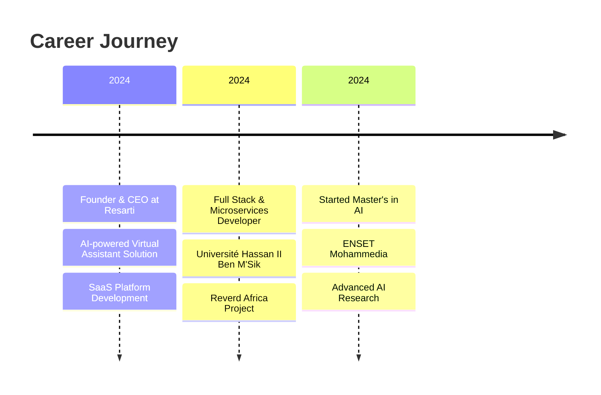

<div align="center">
  

  <div align="center">
    
  </div>

  [](https://github.com/malakzaidi)
  [](https://linkedin.com/in/malak-zaidi/)
</div>

<h2 align="center">
  
  About Me
</h2>

```javascript
const malak = {
    education: "Master's in AI & Distributed Systems @ ENSET Mohammedia",
    background: ["Computer Science", "Mathematics"],
    currentRole: "Founder & CEO @ Resarti",
    passions: ["AI Innovation", "Scalable Solutions", "Green Technology"],
    skills: {
        ai_ml: ["PyTorch", "TensorFlow", "Federated Learning", "Computer Vision"],
        backend: ["Java", "Spring Boot", "Node.js", "Microservices"],
        frontend: ["React.js", "JavaScript", "HTML5/CSS3", "Bootstrap"],
        cloud: ["Docker", "Kubernetes", "Google Cloud", "Firebase"],
        databases: ["PostgreSQL", "MongoDB", "Hibernate"],
        tools: ["Git", "Maven", "Kafka", "Postman"]
    }
};
```

<div align="center">
  
  
</div>

## 🚀 Featured Projects

<details>
<summary><b>🌍 Reverd Africa - Climate Solutions Platform</b></summary>
<br>

- Developed a microservices-based web application for managing climate solutions in Africa
- Tech Stack: React.js, Spring Boot, Spring Cloud, Netflix Eureka
- Key Features:
  - Microservices Architecture
  - Real-time Data Processing
  - Scalable Infrastructure
  - Environmental Impact Tracking
</details>

<details>
<summary><b>🏥 Healthcare Federated Learning Visualization</b></summary>
<br>

- Created an innovative simulation for privacy-preserving AI in healthcare
- Tech Stack: PyTorch, Matplotlib, Manim, NumPy
- Achievements:
  - Implemented distributed training workflow
  - Created advanced data visualizations
  - Demonstrated real-world AI applications
</details>

<details>
<summary><b>🤖 ChatEnset - Educational AI Assistant</b></summary>
<br>

- Built an AI-powered chatbot for enhanced learning experiences
- Tech Stack: NLP, Python, Machine Learning
- Impact:
  - Improved student engagement
  - Streamlined learning processes
  - Successfully presented at ENSET
</details>

## 💼 Professional Experience



## 🛠️ Tech Stack

<div align="center">
  


</div>

## 📈 GitHub Activity

<div align="center">
  
</div>

## 🎓 Certifications & Achievements

- IBM Cloud Computing (Credential ID: MBENTLS7JB2Q)
- Strategic Thinking 101 (Arizona State University)
- Accenture AI Fundamentals
- INCO Academy Green Digital Skills
- Microsoft Azure Synapse Solutions

## 📫 Let's Connect!

<div align="center">
  
[](mailto:your.email@example.com)
[](https://linkedin.com/in/malak-zaidi/)
[](https://github.com/malakzaidi)

</div>

<div align="center">
  
</div>
