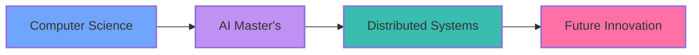

  

  

 

  
  
  

<h2 align="center">🌟 About Me 🌟</h2>

  
<em>Transforming complex problems into elegant solutions through AI and distributed systems</em>

  
  

 

<h2 align="center">🚀 Journey Highlights</h2>

<h2 align="center">💻 Technical Arsenal</h2>

  

    
<b>🤖 AI & Machine Learning</b>

     
    
     
    
    
    
    
  

  

    
<b>🌐 Full Stack Development</b>

     
    
     
    
    
    
  

  

    
<b>🛠 DevOps & Cloud</b>

     
    
     
    
    
    
  

<h2 align="center">📊 GitHub Analytics</h2>

  
    
  

<h2 align="center">🤝 Connect With Me</h2>

  
  &nbsp;&nbsp;
  

 

  

<!-- Profile Views Counter -->

  

